# servidor-ubuntu

Agregar nombre, imagen y desactivar modo desatendido.

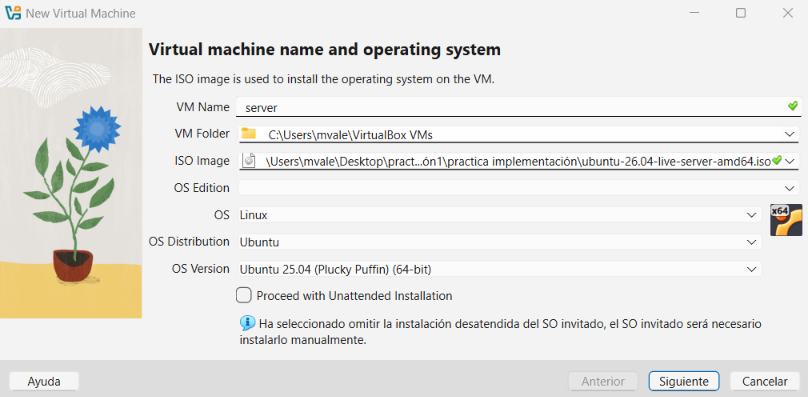

Ajustamos configuraciones dependiendo de los servicios que vamos a manejar y del espacio disponible de nuestro equipo.

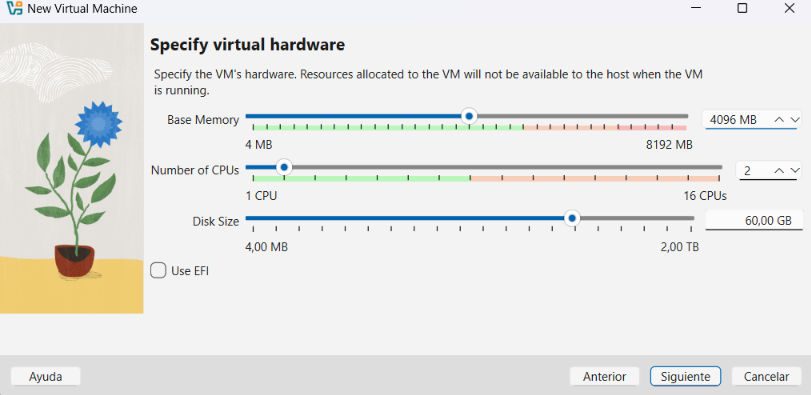

Damos enter.

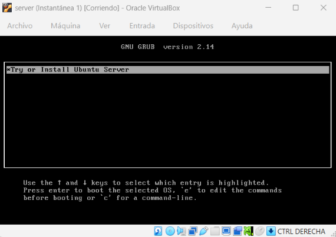

Seleccionamos el idioma.

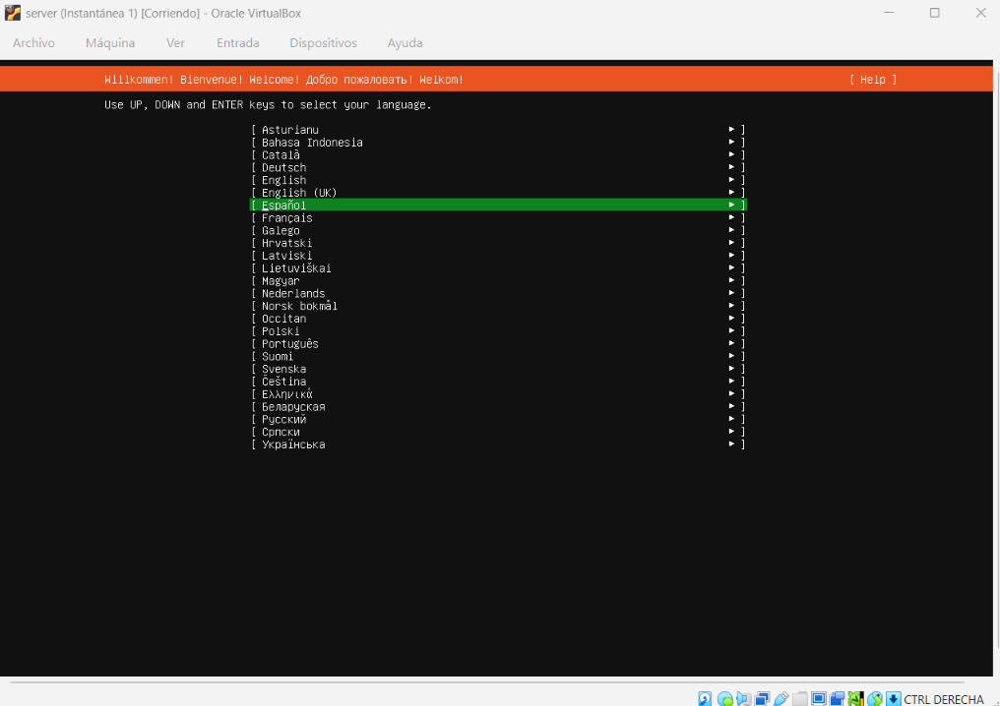

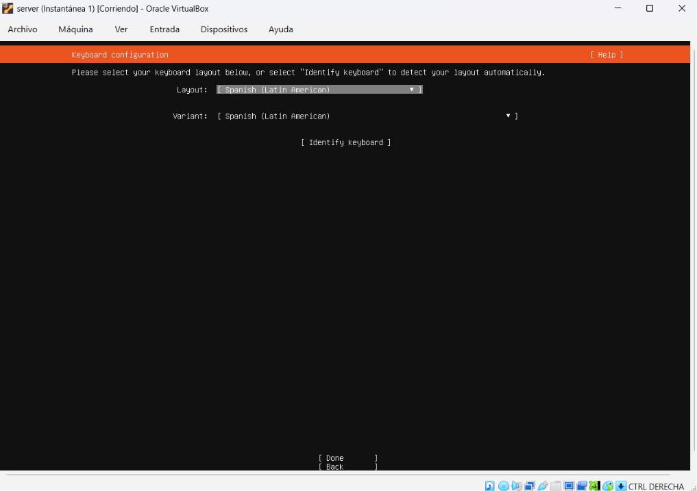

Lo dejamos igual, permite instalar todos sus paquetes.

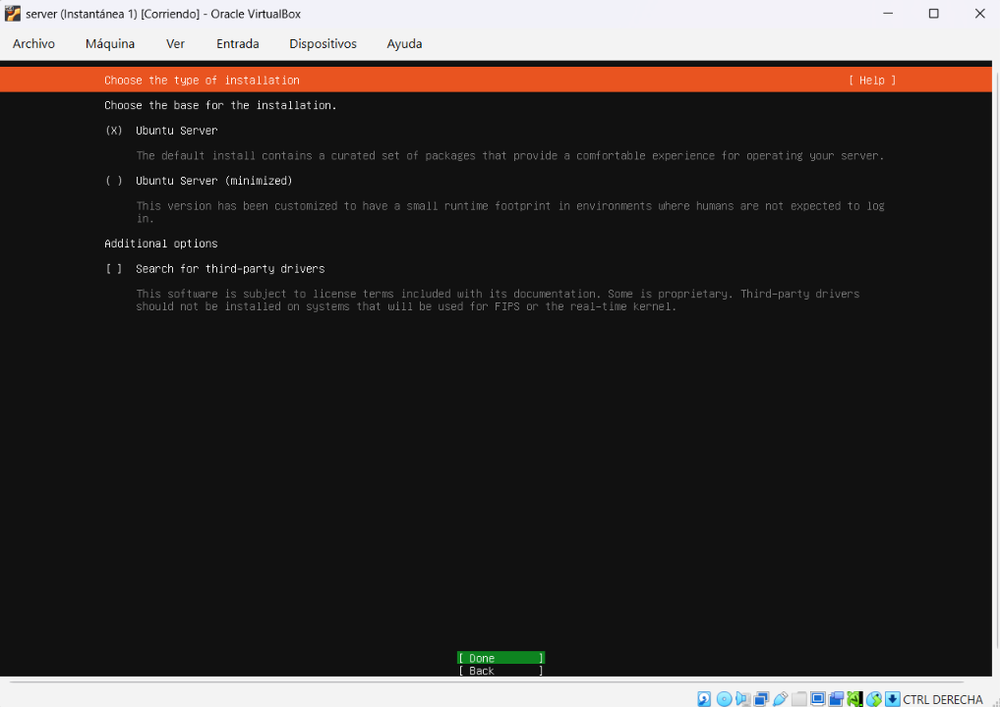

Dejamos la configuración por defecto.

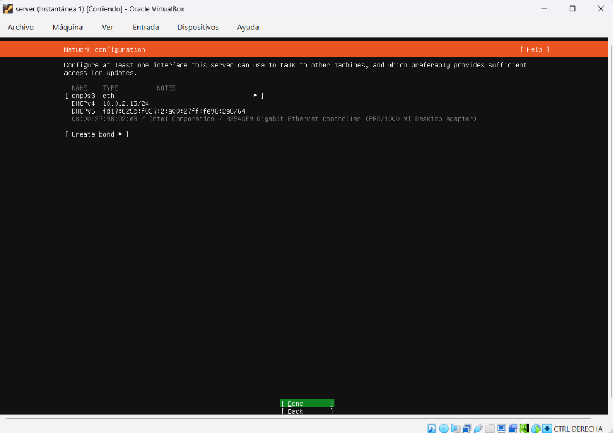

No modificamos el proxy.

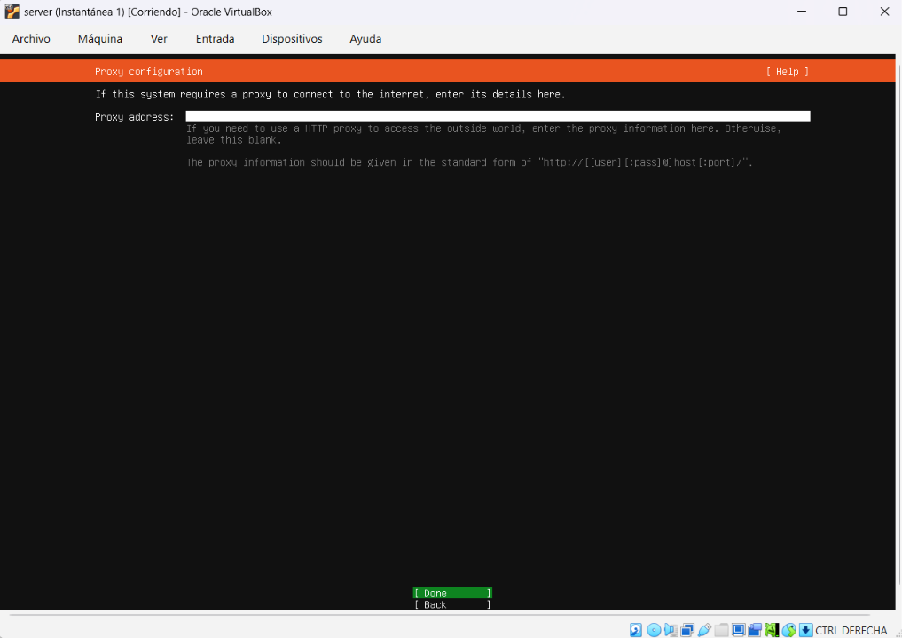

Modificamos este mirror a este otro, ya que el primero no funciona.

```
http://co.archive.ubuntu.com/ubuntu/
```

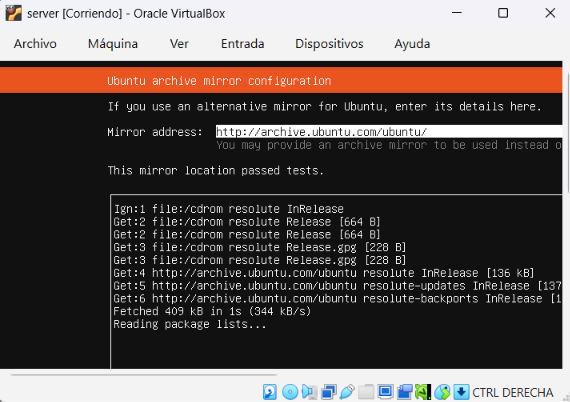

Utilizamos el disco tal cual.

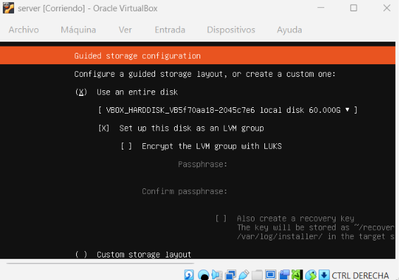

No se mueve nada.

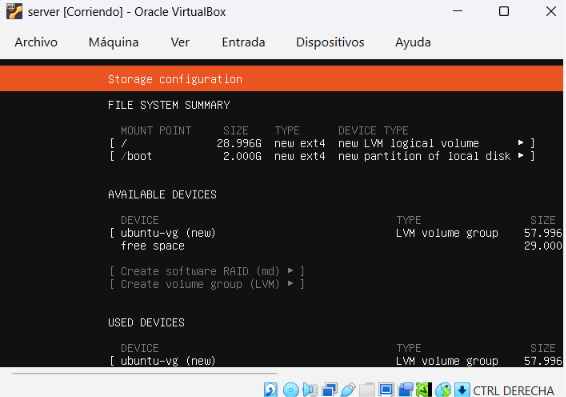

Configuramos nuestro servidor con nuestras credenciales.

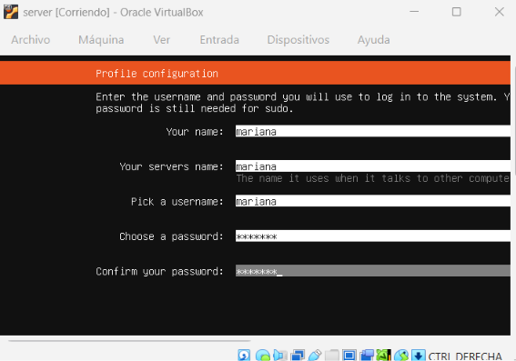

Saltamos Ubuntu Pro.

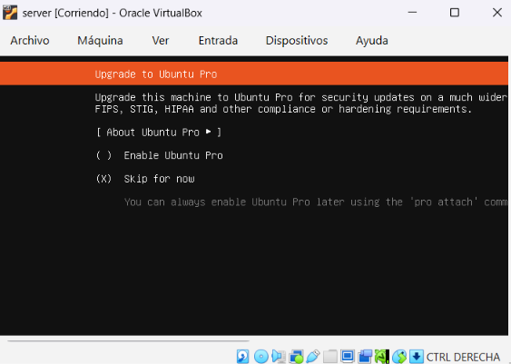

Añadimos el protocolo SSH.

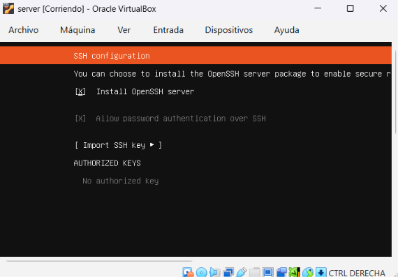

No seleccionamos ninguna.

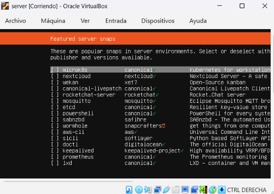

Esperamos a que cargue.

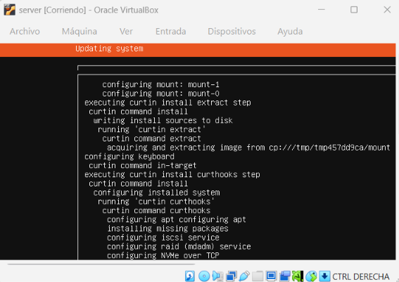

Reiniciamos nuestra vm.

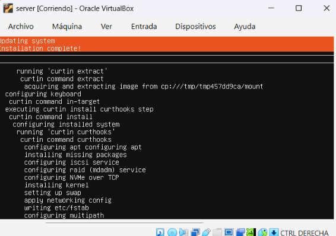

Agregamos nuestro login y contraseña.

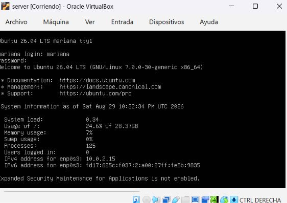

Configuramos reenvío de puertos.

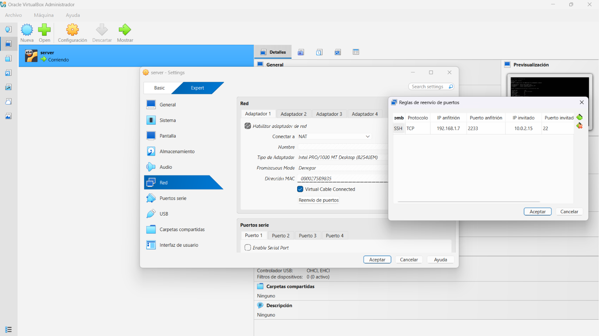

Ya podemos trabajar desde PowerShell.

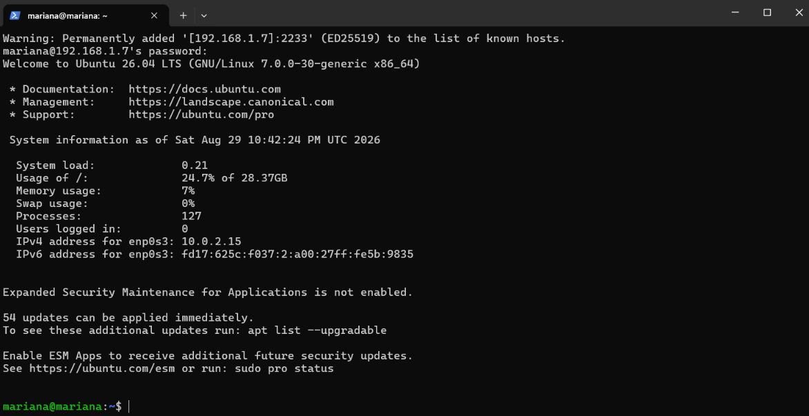
